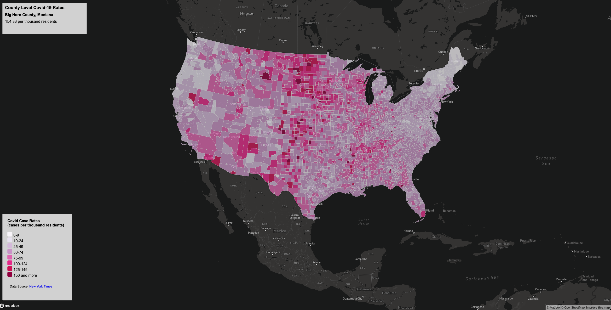
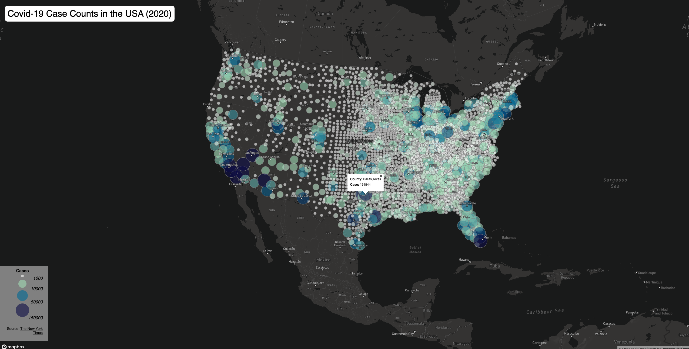

# Covid-19 Case Rates & Counts Thematic Maps

## Introduction

In this project, I show two thematic maps: 1) a choropleth map of the Covid-19 rates (map1.html) and 2) a proportional symbols map of Covid-19 cases (map2.html).

In the first map I use ....

In the second map I use ...

## Links to the maps

Covid-19 Rates Choropleth Map -

Covid-19 Case Proportional Symbols Map -

## Screenshots of the Maps

Covid-19 Rates Choropleth Map

Covid-19 Case Proportional Symbols Map

## Functions

The function I used for were...

## Additional Information

### Libraries

### Data Sources
The COVID-19 case/death data used are originally from The New York Times. The data includes all the cases in 2020. The population data used for calculating the case rates are from the 2018 ACS 5 year estimates. Both data are at the county level. The U.S. county boundary shapefile was downloaded from the U.S. Census Bureau. The data has been processed by UW Geography 458 team in order to suit the purpose of this project.
The case rate was calculated as cases per thousand residents.

### Credit Acknowledgment
The data has bee processed by Steven Bao, I appreciate Steven's assistance in creating the lab data.
